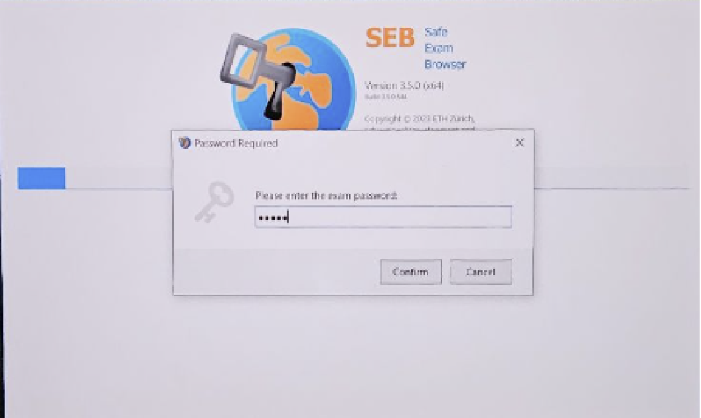

# Safe Exam Broswer 사용법
## 개요
Safe Exam Broswer(이하 SEB)는 정해진 주소 외에 네트워크 및 로컬 접속을 막는 시험용 웹 브라우저입니다. 

본 과목 중간고사 및 기말고사에서 학생들은 지참한 노트북에 SEB를 설치해서 시험을 칠 예정입니다. 

## 설치
먼저, 윈도우 혹은 맥 OS가 설치된 노트북이 필요합니다. 
SEB는 리눅스를 지원하지 않습니다. 

만약 적절한 OS가 설치된 노트북이 없다면 학과 행정실에서 대여하거나, 혹 이마저도 불가능한 상황에서는 최대한 빨리 조교(pp@sf.snu.ac.kr)에게 연락 바랍니다. 

노트북이 준비되었다면, https://safeexambrowser.org/download_en.html 에서 운영체제에 맞는 버전을 다운받아 설치합니다. 

## 실행

접기/펼치기

1. 제공된 SEB Configuration File의 압축을 풀고 실행합니다. 

주의 : 실행 전에 입장 비밀번호와 퇴장 비밀번호를 각각 외워두어야 합니다. 
비밀번호를 모르면 입/퇴장이 불가능합니다. 

2. 입장 비밀번호를 입력합니다. 

3. gitlab 계정으로 로그인합니다. 
(실제 시험에서는 시험용 계정이 제공될 예정입니다.)

4. pp-assignment-0 repository에 들어갑니다. 
(실제 시험에서는 시험용 repository에 들어가시면 됩니다.)

5. Edit - Web IDE 를 눌러 편집창을 띄웁니다. 

5-1. Edit - Web IDE 를 눌렀을 때 SEB를 종료한다는 팝업이 뜬다면 (특히 mac에서), 
[이 글](https://github.com/snu-sf-class/pp202402/issues/16#issuecomment-2428237641)을 참고하시기 바랍니다.

6. 좌하단의 버튼을 눌러 창을 전환하고, 원래 gitlab 페이지에서 아무 문장이나 복사합니다. 

7. 편집창으로 돌아가 `src/main/scala/Main.scala` 파일의 내용을 적당히 수정하고 저장합니다. 
    혹 붙여넣기가 안 된다면 원본 문장을 하이라이트한 후 Drag and Drop 해보십시오. 

8. 편집창 왼쪽의 git UI를 통해 Commit message를 적고, `Commit to 'main'` 버튼을 누릅니다. 

8-1. 경고가 뜬다면 Continue 버튼을 눌러 무시합니다. 

9. 원래 gitlab 페이지로 돌아가 commit이 반영된 것을 확인합니다. 

10. 우하단의 버튼을 누르고 퇴장 비밀번호를 입력해서 퇴장합니다.

## SEB에서 나갈 수 없다면
1. 노트북 전원을 종료합니다. 
2. 안전모드로 진입합니다. 

    [Windows](https://support.microsoft.com/en-us/windows/start-your-pc-in-safe-mode-in-windows-92c27cff-db89-8644-1ce4-b3e5e56fe234)

    [macOS](https://support.apple.com/guide/mac-help/start-up-your-mac-in-safe-mode-mh21245/mac#:~:text=Turn%20on%20or%20restart%20your,Boot%E2%80%9D%20in%20the%20menu%20bar)

3. SEB를 제거합니다. 

## 실제 시험 시 유의사항
- 입장 비밀번호는 시험 시작과 함께 제공될 예정입니다. 

    퇴장을 위해 손을 들고 조교를 부르시면, 조교가 퇴장 비밀번호를 입력해드리겠습니다. 

- Gitlab 페이지에서는 코드의 수정이 가능하지만 컴파일하고 테스트를 돌려볼 수는 없습니다. 

    실제 시험에서는 gitlab 페이지에서 coder(웹에서 vscode와 유사한 환경을 제공) 링크를 제공할 예정입니다. 

    coder에서 코드를 작성하고 (컴파일 및 테스트하고) 복사한 후 gitlab 편집창에 붙여넣고 commit을 남기시면 됩니다. 

    가장 마지막 commit 내역이 채점에 반영됩니다. 

- 내용이 날아가지 않도록 자주 commit을 남기시는 것을 권장합니다. 